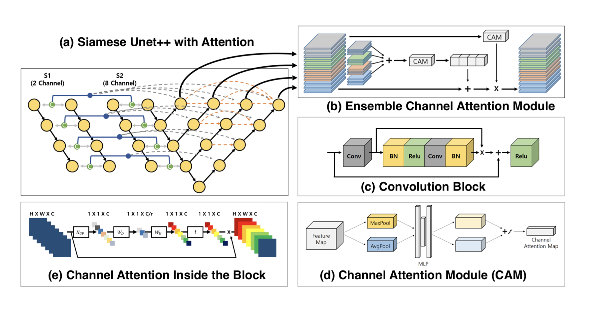
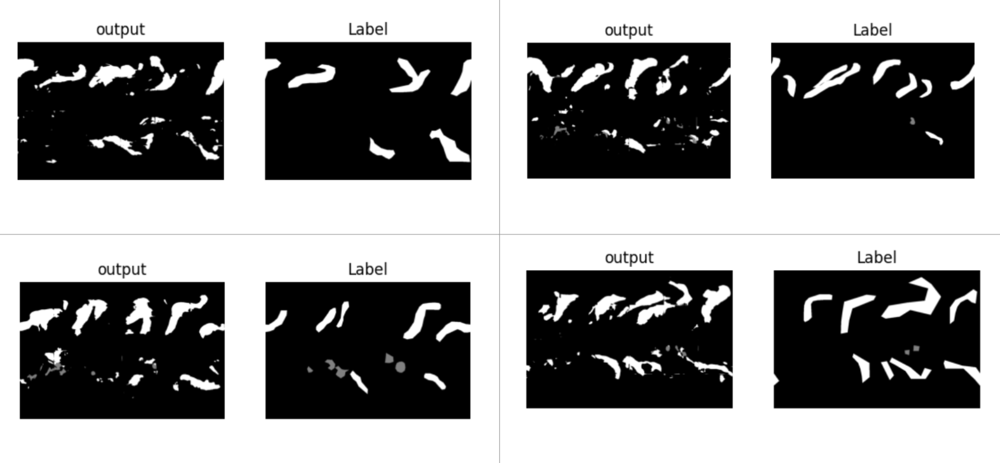

# Planet A : Geological Disaster

The final submitted pytorch code for the **Planet A** Challenge

## Abstract
Geological disasters such as earthquakes, volcanoes, or landslides make buildings or roads in downtown areas lost, 
or buildings are newly built in the process of disaster recovery. 
The purpose of the ***Planet A: Geological Disaster Section*** is to develop a deep learning model that can detect 
changes in urban areas using satellite images
Specifically, The geological disaster problem is to detect changes in five cities with unknown answers through  15 types
of channel data (various satellite bandwith data) taken from 19 cities. [[A1]](##Reference) To solve the problem, We 
applied the multimodality of [[A3]](##Reference) to the Combination of Siamese network and NestedUNet structure 
presented in [[A2]](##Reference). Then, we used the channel-wise attention module used in the RCAN structure of 
[[A4]](##Reference) for each block.

## Project Structure
```
├──  data
│    └── train - train data folder
│       ├── data-1996-06-09-01-1_0.nc
│       ├── data-1996-07-11-01-1_0.nc
│       ├── ...
│       └── data-2010-10-29-01-1_0.nc
│    └── test - test data for submission
│       ├── data-2011-06-01-01-1_0.nc
│       ├── ...
│       └── data-2013-09-27-01-1_0.nc 
|
├──  train  
│    └── train.py
│
├──  result
│   ├── netname1    
│   └── netname2 ...
│
└── utils   - utility files  
    ├──  model  
    │    └── UNETpp.py  - UNET++ implementation
    │
    ├──  data_load  
    │    └── Data_Loader.py
    │    
    └── common
         ├── loss.py
         ├── plot_result.py
         └── save_reconstruction.py 
```

## Model Structure


## Details

### Data Processing
The shape of the data was 768 and 1152, all same. Therefore, since the greatest common factor of 768 and 1152
is 192, all data will be divided into patches of 192X192 and learned. Through this, it was possible to secure a total
of 24 sheets per data and 4,440 sheets of learning data. The _get_tile_idx function inside the class finds and stores
the sliding point of the image. As a result of EDA, the pixel distribution of the entire train data could be obtained 
as a histogram. By doing so, we could decide MinMaxScaling was suitable for this data. In the case of Augmetaion such 
as Flip and Rotation, since it distorts the important characteristics of latitude and longitude of the data, we didn't
implement it.

### Train Phase

For learning, we used the Pytorch framework. A batch size of 16 was used for learning, and Adam was used as an
optimizer. 5e-4 was used as the learning rate, and the Learning Rate Decay Scheduler, which decreases by 0.95 per
epoch, was introduced. To prevent overfitting, Adam Optimizer was given a weight decay of 1e-3. Cross entropy loss
was used as the loss of learning. Cross Entropy Loss, which can manually set weights, was a great help for learning.
We used Google Lab for learning. The model had 11240875 parameters.

### Result Example



## TODO List
- Arg Parser be updated soon!

## Reference
```
[B1] Wikipedia contributors. (2022, September 19). Atmospheric river. In Wikipedia, The Free Encyclopedia. Retrieved 09:25, September 20, 2022, from https://en.wikipedia.org/w/index.php?title=Atmospheric_river&oldid=1111222086
[B1] Zhang, Yulun, et al. "Image super-resolution using very deep residual channel attention networks." Proceedings of the European conference on computer vision (ECCV). 2018.
[B2] Fang, Sheng, et al. "SNUNet-CD: A densely connected Siamese network for change detection of VHR images." IEEE Geoscience and Remote Sensing Letters 19 (2021): 1-5.
```
